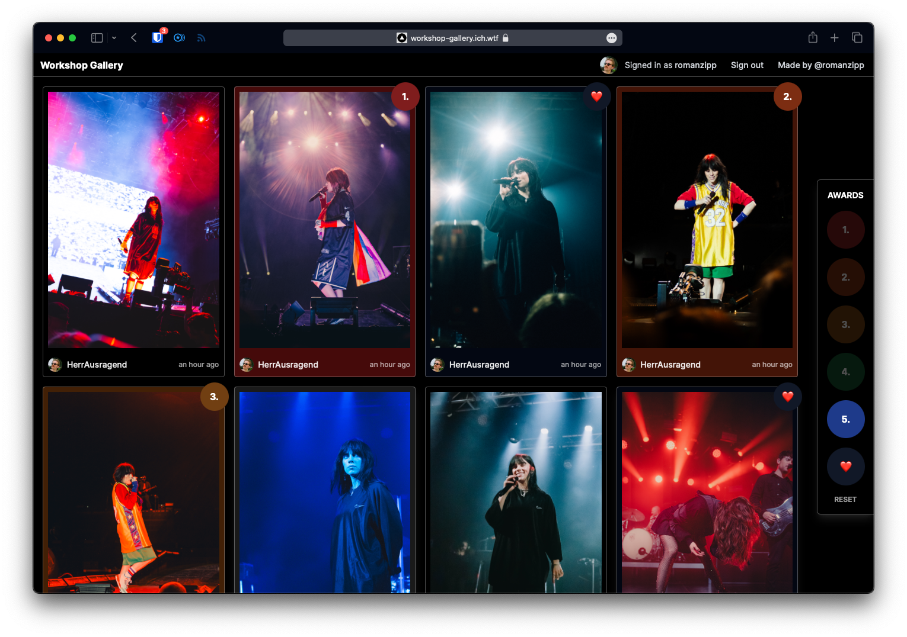

# Discord Workshop Gallery

A web tool made for [Lloyd Wakefields](https://www.instagram.com/lloyddddddddddddddddd/) Discord Workshop which shows all recent image submissions in a gallery view.

## Features

- Gallery view with all recent image submissions
- Give awards (place 1 - 5 + extra mentions) to submissions
- Fully responsive
- Stateless architecture - no database



## Setup

**Install dependencies**

```
npm install
```

**Start development server**

```
npm run dev
```

## Configuration

```env
DISCORD_CLIENT_ID=
DISCORD_CLIENT_SECRET=
DISCORD_BOT_TOKEN=
DISCORD_BOT_PERMISSIONS=66560

NEXTAUTH_SECRET=
NEXTAUTH_URL=

PRESELECT_GUILD_ID=
PRESELECT_CHANNEL_ID=
```

- `DISCORD_CLIENT_ID`: The Discord OAuth Client Id
- `DISCORD_CLIENT_SECRET`: The Discord OAuth Client Secret
- `DISCORD_BOT_TOKEN`: The generated secret Bot Token from Discord
- `DISCORD_BOT_PERMISSIONS`: Permissions needed (currently `66560`)
- `NEXTAUTH_SECRET`: A randomly generated secret string for encrypting JWTs
- `NEXTAUTH_URL`: The base URL of the project
- `PRESELECT_GUILD_ID`: A guild to preselect and skip the guild selection step
- `PRESELECT_CHANNEL_ID`: A channel to preselect and skip the channel selection step

## License

The [CC BY-ND 4.0 Deed License](https://creativecommons.org/licenses/by-nd/4.0/deed.en). See the [license file](LICENSE.txt) for more information.

## Authors

[Roman Zipp](https://romanzipp.com)
